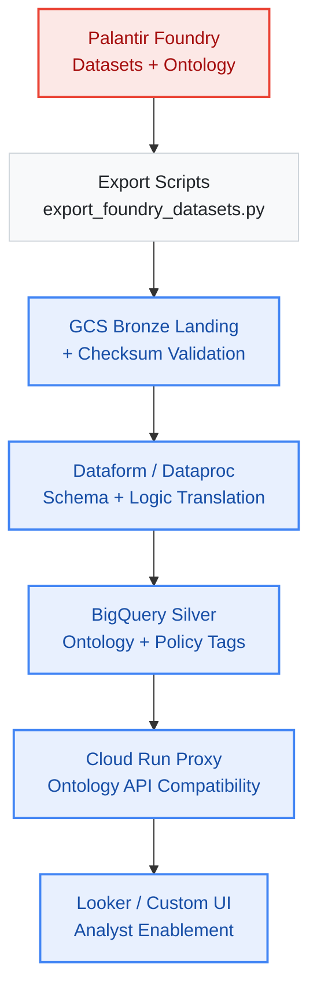

# Palantir Foundry to Google Cloud: The V7 Migration Framework

This repository provides the **Universal Enterprise Standard (V7)** blueprint for deconstructing a Palantir Foundry deployment and rebuilding it on native Google Cloud Platform (GCP) services. 

> [!IMPORTANT]
> **Dual-Layer Architecture:** This repository is both a boardroom strategy playbook and an engineering execution engine. The `docs/` directory provides the universally defensible governance framework, while the `scripts/` directory contains the Python automation tools required to physically operationalize the migration (e.g., AST parsing, security metadata scraping, and API proxies).

Migrating away from Palantir is not a simple "lift-and-shift." Foundry is deeply integrated vertically. This framework is designed to deconstruct that vertical lock-in and map it to GCP's open, modular ecosystem.

## Phased Migration Timeline (Engineering Toolkit)

To execute this migration without disrupting operations, you must follow a sequenced rollout—moving from raw technical execution to robust validation.

### Architecture



### Phase 0: Data Discovery (Pre-Migration Baseline)
Establish the foundation by validating baselines and risks before moving any data.
*   **Data Inventory:** Systematically catalog all Foundry datasets, pipelines, and ontologies.
*   **Classification:** Tag datasets by sensitivity (PHI, PII, financial, operational).
*   **Lineage Mapping:** Document upstream/downstream dependencies before migration.
*   **Outcome:** A complete “data map” that defines scope, risk, and migration sequencing.
*   **Reference:** [MIGRATE_DATA_DISCOVERY.md](./docs/MIGRATE_DATA_DISCOVERY.md)

### Phase 1: Data Governance (Foundational Guardrails)
Apply strict policy control before provisioning infrastructure.
*   **Policy Framework:** Define enterprise rules for access, retention, and compliance.
*   **RBAC & Policy Tags:** Apply BigQuery Policy Tags, Dataplex RBAC, and row-level filters.
*   **Stewardship Lifecycle:** Assign data owners, approval workflows, and lineage correction processes.
*   **Outcome:** Governance embedded into IaC and CI/CD, ensuring compliance is continuous, not one-off.

### Phase 2: Infrastructure & Pipeline Refactoring
Migrate datasets and pipelines with fidelity and regression testing.
*   **Execution:** Deploy multi-region IaC. Execute egress strategies (Transfer Appliance, peering). Apply checksum reconciliation.
*   **Translation:** Translate Spark/SQL to Dataproc + Dataform. Map Magritte to Pub/Sub + Dataflow.
*   **Assurance:** Integrate semantic and performance regression suites into CI/CD. Tie technical latency SLAs to contracts with penalty mitigation.

### Phase 3: Semantic Rebuild & Analyst Enablement
Recreate the ontology and rebuild apps while ensuring analyst adoption.
*   **Execution:** Map Ontology to BigQuery JSON/STRUCTs. Enable lineage propagation. Replace Slate/Workshop with Looker + Cloud Run.
*   **Assurance:** Enforce Git-backed Colab workflows. Track CSAT + usage telemetry. Execute remediation playbooks (office hours, gamification) if adoption lags.

### Phase 4: Streaming & Provenance
Preserve real-time pipelines and immutable history for compliance.
*   **Execution:** Enforce schema registry + SLA monitoring. Implement GCS lifecycle tiering via Org Policies (Standard→Archive).
*   **Assurance:** Build auditor dashboards and run beta UX testing with internal/external regulators to validate self-service.

### Phase 5: Global Governance & Executive ROI (Final)
Institutionalize resilience and prove ROI to the boardroom.
*   **Execution:** Institutionalize DR drills in governance charter. Version-control policy catalogs via GitOps.
*   **Assurance:** Present audited ROI case studies (multi-industry pilots) to the CFO/CEO proving the 80% run-rate cost reduction.

---

## Alignment with Official Documentation
The V7 Universal Enterprise Standard does not duplicate the official Palantir or Google Cloud documentation; it complements it. 

While official vendor documentation focuses on **"what is possible"** (integration connectors and marketplace deployment), this framework provides the **"how to execute"**—the forensic discovery, governance sequencing, and contractually defensible migration path that vendors deliberately omit.

*   [See the full mapping of V7 deliverables to official Palantir/GCP documentation here.](./docs/OFFICIAL_DOCS_MAPPING.md)
*   [View the Executive Pitch Deck (Boardroom slides) here.](./docs/EXECUTIVE_PITCH_DECK.md)

---## Engineering Migration Maturity Model

This framework maps technical execution to operational outcomes using a tiered maturity model:

*   **Bronze (Infrastructure & Logic):** Data is liberated to multi-region GCS; logic runs on Dataform/Dataproc.
*   **Silver (Semantics & UI):** Ontology is rebuilt in BigQuery/Dataplex with strict stewardship.
*   **Gold (Governance & Compliance):** Full CI/CD security propagation, VPC-SC perimeters, SLA-monitored streaming, and automated tiering.

## Infrastructure as Code (IaC) Quick Start
To rapidly provision the GCP landing zone (BigQuery, GCS, Dataplex, Composer, Pub/Sub), use the provided Terraform modules. Ensure you deploy within a VPC Service Perimeter (VPC-SC) for enterprise compliance.
```bash
cd terraform
terraform init
terraform apply -var="project_id=YOUR_PROJECT_ID"
```

---
## Project Structure
*   `docs/`: Contains the detailed technical playbooks and the [Execution Toolkit](./docs/EXECUTION_TOOLKIT.md) for running the automation engines.
*   `scripts/`: Contains the Python automation engines (Metadata Scrapers, Schema Converters, API Proxies) required to operationalize the migration.
*   `terraform/`: Contains the IaC to provision the GCP landing zone.
