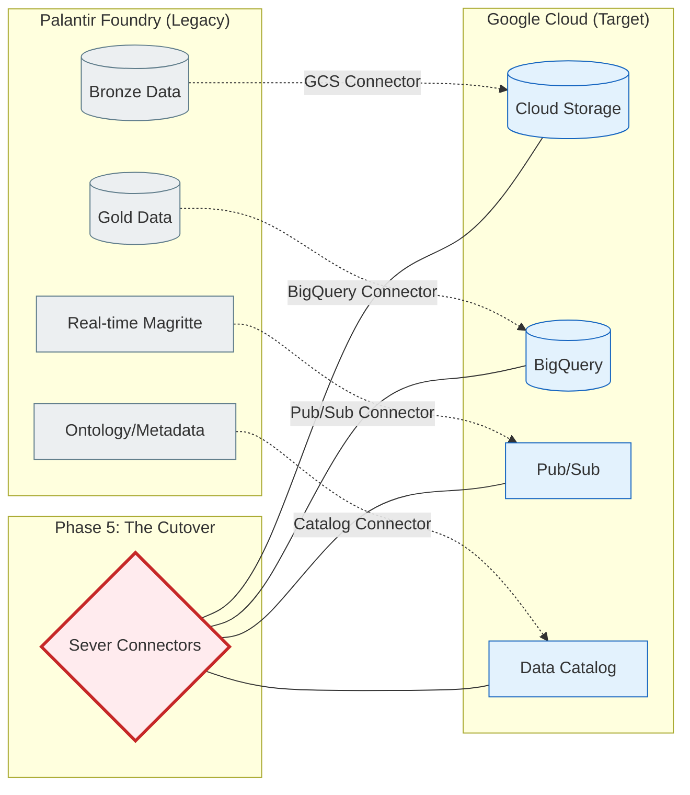

# Executive Pitch Deck: Exiting Palantir Foundry

*Use this deck to secure boardroom approval and auditor confidence for the GCP migration.*

---

## Slide 1: The Migration Imperative
**Title:** Escaping the "Federated Lock-in" Trap

**The Situation:** 
Palantir has built native connectors to Google Cloud (BigQuery, Pub/Sub, Data Catalog). 
While powerful, relying solely on these connectors creates a "Federated Lock-in" where we pay for GCP compute *and* the Palantir module license indefinitely.

**The Solution:**
The V7 Universal Enterprise Standard. A forensic, auditable, and contractually defensible framework to permanently sever the Palantir control plane while maintaining semantic fidelity and ensuring zero downtime.

> [!WARNING]
> **The Brutal Truth:** Vendor documentation tells you "what's possible" (moving data). The V7 Framework provides the "how to execute safely" (forensic discovery, governance sequencing, regulator sign-off).

---

## Slide 2: The Executive Crosswalk (Closing the Gap)
**Title:** Why We Need More Than Just Connectors

*This is the missing half of the migration story. Here is how we close the gaps left by standard vendor integration tools:*

| Migration Phase | Official Vendor Tooling | The Execution Gap Closed by V7 |
| :--- | :--- | :--- |
| **Phase 0: Dataset Inventory** | BigQuery Connector | Adds **classification & lineage sequencing** *before* data moves. |
| **Phase 2: Pipeline Refactoring** | Pub/Sub Connector | Adds **cutover sequencing** & proprietary decorator stripping. |
| **Phase 3: Ontology Export** | Knowledge Catalog Integration | Enforces **semantic fidelity** via BigQuery `JSON/STRUCT`. |
| **Phase 4: Provenance** | GCS Archival / BigQuery Snapshots | Adds **auditor dashboards** & exception governance. |
| **Phase 5: Global ROI** | Joint Customer Success Stories | Institutionalizes **multi-regulator sign-off** & FinOps audits. |

---

## Slide 3: Phase 0 & 1 - Discovery & Governance
**Title:** Securing the Baseline Before Opening the Firewall

**Vendor Approach:** Open the BigQuery connector and sync the data.
**V7 Framework Approach:**
1.  Systematically catalog all datasets and pipelines.
2.  Tag datasets by sensitivity (PHI, PII).
3.  Map upstream/downstream dependencies.

> [!IMPORTANT]
> **The Brutal Truth:** If you move data without a baseline, you violate compliance. The V7 framework provides auditable classification *before* the first byte is transferred.

---

## Slide 4: The 360° Boardroom Narrative
**Title:** Aligning the Enterprise on the Execution Strategy

*The V7 Framework provides a unified narrative tailored to the distinct concerns of each C-Suite stakeholder:*

| Stakeholder | The Core Concern | The V7 Framework Solution |
| :--- | :--- | :--- |
| **CFO** | "Are we double-paying for compute and licenses?" | We execute an 80% run-rate takeout by severing the Palantir module license at Phase 5. |
| **CISO** | "Will data be exposed during the transit?" | Phase 0 classification ensures no unclassified data leaves the Azure firewall. |
| **Auditor** | "How do we prove provenance after the move?" | Automated Dataplex lineage and read-only BigQuery snapshots satisfy SEC/FINRA mandates. |
| **Analyst** | "Will my dashboards break?" | Semantic rebuilds via BigQuery `JSON/STRUCT` preserve relationship topologies. |

---

## Slide 5: The Egress Architecture (The "Severed Bridge")
**Title:** Automating Extraction with Native Connectors

*We deploy native vendor connectors for high-fidelity extraction, but we physically sever them at Phase 5 to prevent "Federated Lock-in."*

---

## Slide 6: Phase 2 - Infrastructure & Pipeline Refactoring
**Title:** Rewriting the Logic, Not Just Moving the Data

**Vendor Approach:** Deploy Palantir on GCP via the Marketplace.
**V7 Framework Approach:**
1.  Strip proprietary `@transform` decorators.
2.  Refactor Spark/SQL into native GCP Dataproc and Dataform.
3.  Implement CI/CD regression suites tied to SLAs.

> [!CAUTION]
> **The Brutal Truth:** Running Palantir's engine on GCP is not a migration; it's a hosting change. The V7 framework refactors the logic so you can terminate the Palantir license.

---

## Slide 7: Phase 3 - Semantic Rebuild & Analyst Parity
**Title:** Preserving the Ontology Without the Lock-in

**Vendor Approach:** Use federation to query BigQuery from Palantir Contour.
**V7 Framework Approach:**
1.  Rebuild the Ontology in BigQuery using `JSON/STRUCT`.
2.  Sync metadata to Dataplex.
3.  Transition analysts to Looker and Git-backed Colab.

> [!TIP]
> **The Brutal Truth:** Relying on federation keeps you locked into the Palantir UX. The V7 framework enforces semantic fidelity natively in GCP, so analysts don't lose their relationships when we pull the plug.

---

## Slide 8: The Boardroom ROI (The 80% Takeout)
**Title:** The Financial and Operational Win

**The Target State:**
*   **Cost:** 80% reduction in run-rate via native GCP Compute vs Palantir Module Licensing.
*   **Time-to-Value:** Zero "Shadow IT" downtime with culturally-tailored Looker CSAT rebounds.
*   **Risk:** Audit time reduced from 40 hours to 4 hours via curated Looker provenance dashboards.

**The Ask:**
Approval to execute Phase 0 (Data Discovery) on the Lighthouse Pilot workflow to validate baselines and establish the contractual egress plan.
