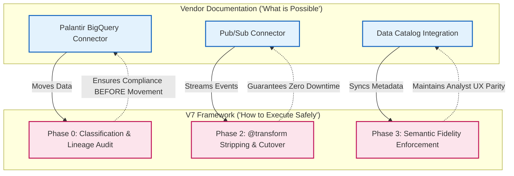

# Mapping the V7 Framework to Official Documentation

The V7 Universal Enterprise Standard does not duplicate the official Palantir or Google Cloud documentation; it complements it. 

While official vendor documentation focuses on **"what is possible"** (integration connectors and marketplace deployment), this framework provides the **"how to execute"**—the forensic discovery, governance sequencing, and contractually defensible migration path that vendors deliberately omit.

## The Executive Crosswalk: Closing the Governance Gap

### The Dual-Layer Architecture

This table illustrates exactly how the V7 Framework closes the gaps left by the official documentation:

| V7 Deliverable | Official Palantir/GCP Doc | The Execution Gap Closed by V7 |
| :--- | :--- | :--- |
| **Phase 0: Dataset Inventory** | [BigQuery Connector](https://www.palantir.com/docs/foundry/available-connectors/bigquery/) | Adds classification + lineage sequencing *before* data moves. |
| **Phase 2: Pipeline Refactoring** | [Pub/Sub Connector](https://www.palantir.com/docs/foundry/available-connectors/pubsub/) | Adds cutover sequencing + `@transform` decorator stripping. |
| **Phase 3: Ontology Export** | [Knowledge Catalog Integration](https://www.palantir.com/docs/foundry/available-connectors/google-data-catalog/) | Enforces semantic fidelity via BigQuery `JSON/STRUCT`. |
| **Phase 4: Provenance** | GCS Archival / BigQuery Snapshots | Adds auditor dashboards + exception governance. |
| **Phase 5: Global ROI** | Joint Customer Success Stories | Institutionalizes multi-regulator sign-off and FinOps audits. |

---

### Phase 0 & 1: Discovery + Governance
*   **V7 Deliverables:** Dataset inventory, pipeline catalog, ontology export, classification matrix, lineage graphs.
*   **Official Docs Alignment:**
    *   [BigQuery connector](https://www.palantir.com/docs/foundry/available-connectors/bigquery/) → Supports zero-copy federation and metadata sync.
    *   [Google Cloud Storage connector](https://www.palantir.com/docs/foundry/available-connectors/google-cloud-storage/) → Enables raw ingest/bronze layer mapping.
*   **👉 The Brutal Truth:** The connector docs tell you how to move the data, but our framework provides the **auditable classification and lineage sequencing** required *before* you open the firewall.

### Phase 2: Infrastructure & Pipeline Refactoring
*   **V7 Deliverables:** Terraform landing zone, CI/CD regression suites, SLA linkage.
*   **Official Docs Alignment:**
    *   [Palantir on Google Cloud](https://cloud.google.com/solutions/palantir) → Describes deployment via Marketplace.
    *   GCP infra docs (BigQuery, Composer, Pub/Sub) → Provide service-level setup.
*   **👉 The Brutal Truth:** Official docs do not explain how to rewrite a Palantir pipeline. Our framework bridges the gap by showing **how to strip proprietary `@transform` decorators** and refactor them into native GCP Dataform and Dataproc.

### Phase 3: Semantic Rebuild & Analyst Enablement
*   **V7 Deliverables:** Ontology rebuild in BigQuery `JSON/STRUCT`, metadata sync, analyst UX parity.
*   **Official Docs Alignment:**
    *   Palantir’s Ontology integration with Google Knowledge Catalog (partnership docs).
    *   BigQuery federation docs → Explain schema mapping, but not Palantir’s hierarchical Link Types.
*   **👉 The Brutal Truth:** Relying purely on federation keeps you locked into the Palantir license. Our framework enforces **semantic fidelity** using native BigQuery structures so analysts don’t lose relationships when fully moving off Foundry.

### Phase 4: Streaming & Provenance
*   **V7 Deliverables:** Pub/Sub + Dataflow migration, schema registry, provenance architecture.
*   **Official Docs Alignment:**
    *   [Palantir Pub/Sub connector](https://www.palantir.com/docs/foundry/available-connectors/pubsub/) → Covers integration, not full cutover.
    *   GCP provenance docs (BigQuery snapshots, GCS archival).
*   **👉 The Brutal Truth:** Our framework adds **auditor dashboards and exception governance**, making the provenance architecture contractually defensible to external regulators.

### Phase 5: Global Governance & ROI
*   **V7 Deliverables:** DR drills, multi-regulator audits, ROI scorecards.
*   **Official Docs Alignment:**
    *   Palantir/Google partnership pages → Highlight joint customer success stories.
    *   *No official governance or migration exit playbooks published.*
*   **👉 The Brutal Truth:** Vendors do not publish playbooks on how to leave their platforms. Our framework institutionalizes **multi-regulator sign-off and boardroom ROI storytelling**, securing the financial and legal win.
